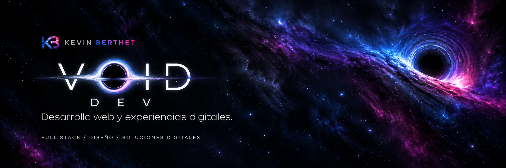

  

  <a href="#proyectos-destacados">Proyectos</a> ·
  <a href="#aplicaciones-y-experiencias">Aplicaciones y experiencias</a> ·
  <a href="#tecnologías">Tecnologías</a>

Soy **Kevin Berthet**, desarrollador web y programador en Argentina. Con **Void** desarrollo aplicaciones full stack, herramientas comerciales e interfaces que combinan funcionalidad y diseño.

Trabajo con **Angular, React, NestJS y PostgreSQL**, desde la experiencia de uso hasta las reglas de negocio y la persistencia de datos.

## Proyectos destacados

### [Clínica · Gestión de turnos](https://github.com/Kingdoms27/TP-CLINICA-DDAW)

*Proyecto académico · Desarrollo de Aplicaciones Web · Grupo K*

Sistema con vistas para pacientes, médicos y administradores. Permite reservar y cancelar consultas, gestionar la agenda y registrar la atención. Incluye autenticación JWT, validaciones, control de reservas duplicadas y conservación del precio de cada consulta.

**Angular · NestJS · PostgreSQL · TypeORM**  
[Ver código, instalación y documentación →](https://github.com/Kingdoms27/TP-CLINICA-DDAW#readme)

### [Clínica OOWS · Modelado y desarrollo web](https://github.com/Kingdoms27/TP-CLINICA-OOWS)

*Proyecto académico · Metodología OOWS · Grupo K*

Sistema de turnos que conecta los modelos conceptual, navegacional y de presentación con una implementación funcional. Incluye recorridos por rol, documentación del dominio, base local y pruebas de integración con PostgreSQL.

**Angular · NestJS · TypeORM · SQL.js / PostgreSQL**  
[Ver código y modelos OOWS →](https://github.com/Kingdoms27/TP-CLINICA-OOWS#readme)

## Aplicaciones y experiencias

Además del código público, trabajo en herramientas para equipos y proyectos de diseño digital.

| Proyecto | Desarrollo |
| :--- | :--- |
| **Lionzador Pro · Master Lions** | Cotizador visual con catálogo, selección de productos, planes de financiación y propuestas para compartir por WhatsApp. |
| **Panel comercial** | Aplicación en React y TypeScript para organizar ventas, comisiones, equipos, objetivos y planificación semanal. |
| **Finley Adventures** | Prototipo de videojuego en GDevelop 5: personajes, niveles, movimiento y colisiones. |

Los repositorios de las herramientas comerciales son privados.

También desarrollo sitios e interfaces animadas, integraciones de HTML/CSS/JS en Odoo, identidad visual y contenido digital.

## Tecnologías

| Área | Herramientas |
| :--- | :--- |
| **Frontend** | Angular · React · TypeScript · JavaScript · HTML · CSS |
| **Backend y datos** | NestJS · Node.js · PostgreSQL · TypeORM · JWT |
| **Desarrollo y documentación** | Git · GitHub · GitHub Actions · Vite · Swagger · Compodoc |
| **Otras experiencias** | Odoo · GDevelop 5 · Diseño digital |

Mi enfoque: interfaces responsive, reglas de negocio claras, validaciones, pruebas y documentación que faciliten el uso y la continuidad de cada proyecto.
